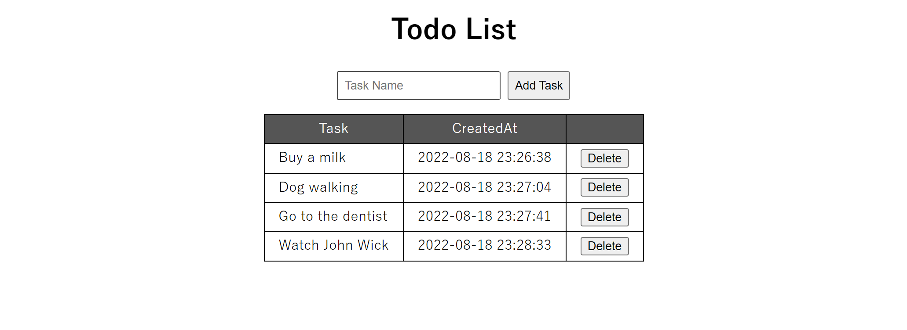

# go-gin-todo



Simplest Todo List Example in Go.

- No JavaScript
- sqlite

## Usage

```
$ go run main.go
```

## Notes

- https://github.com/jinliming2/vscode-go-template
- https://github.com/qwtel/sqlite-viewer-vscode
